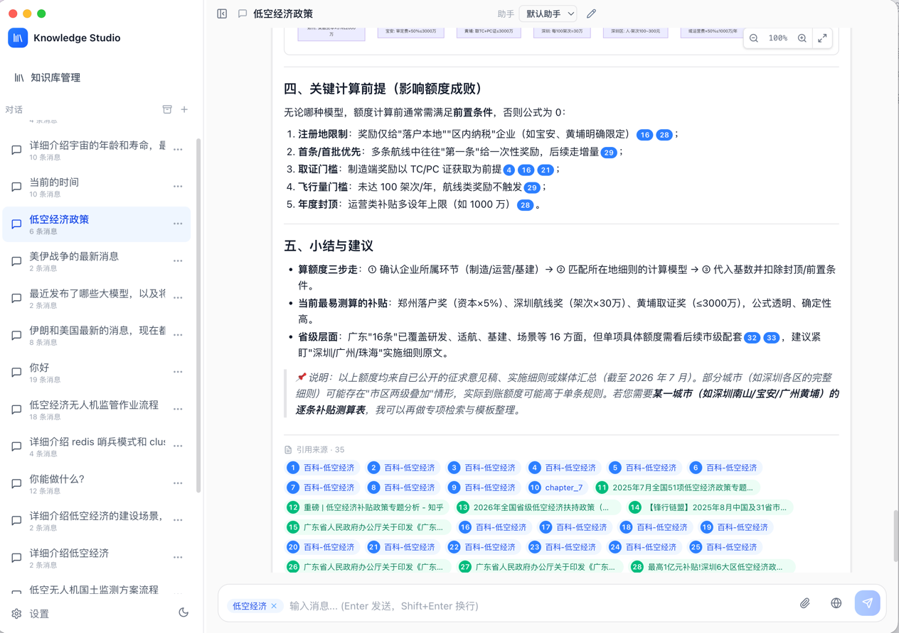
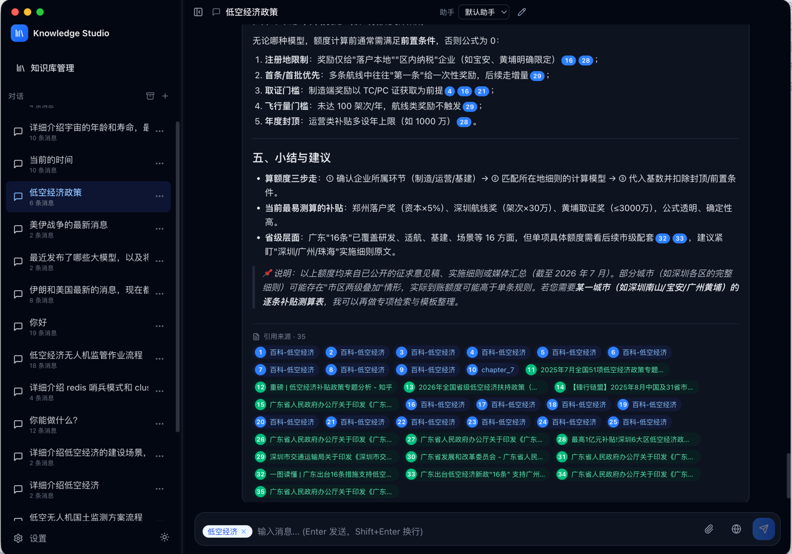
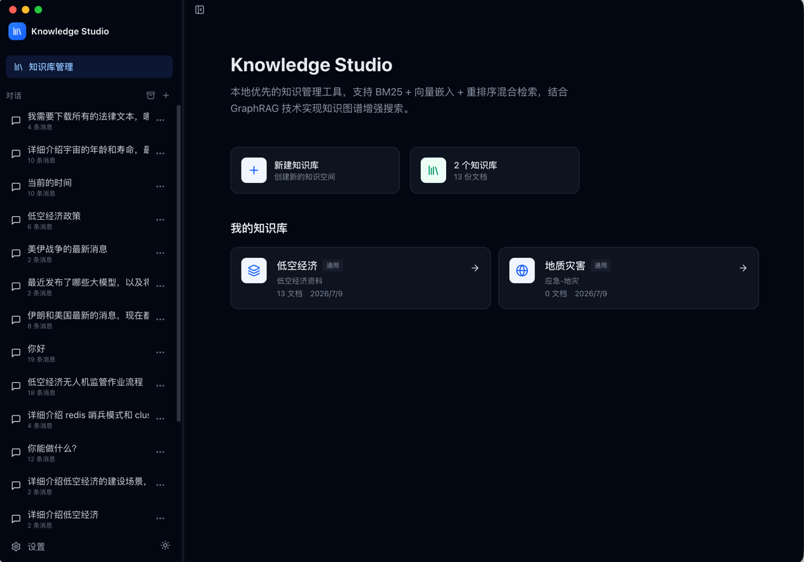
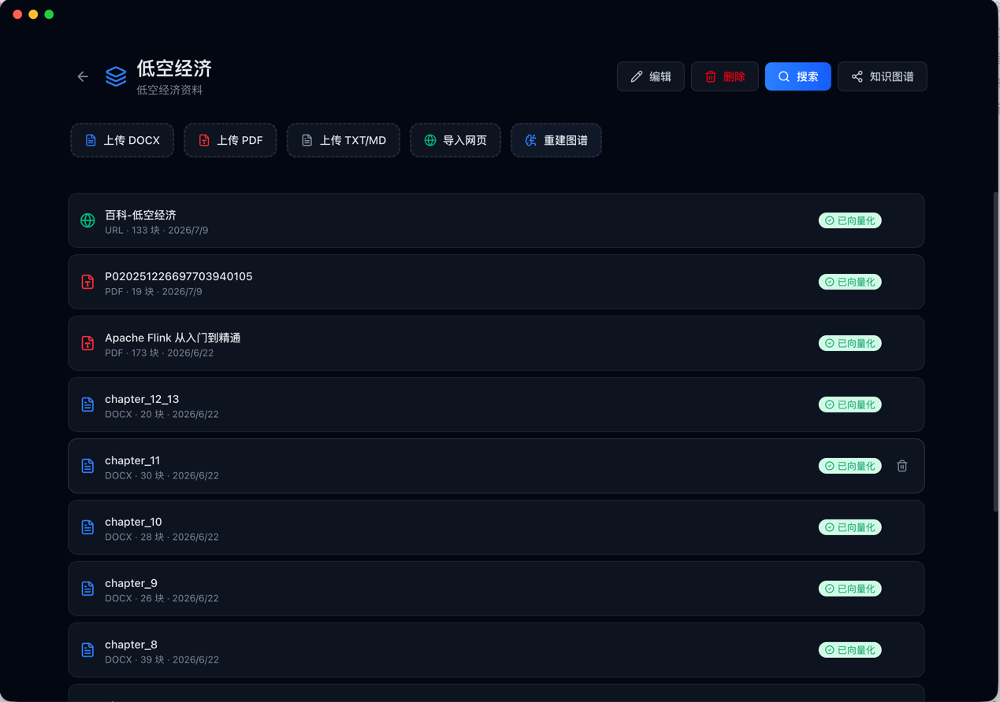
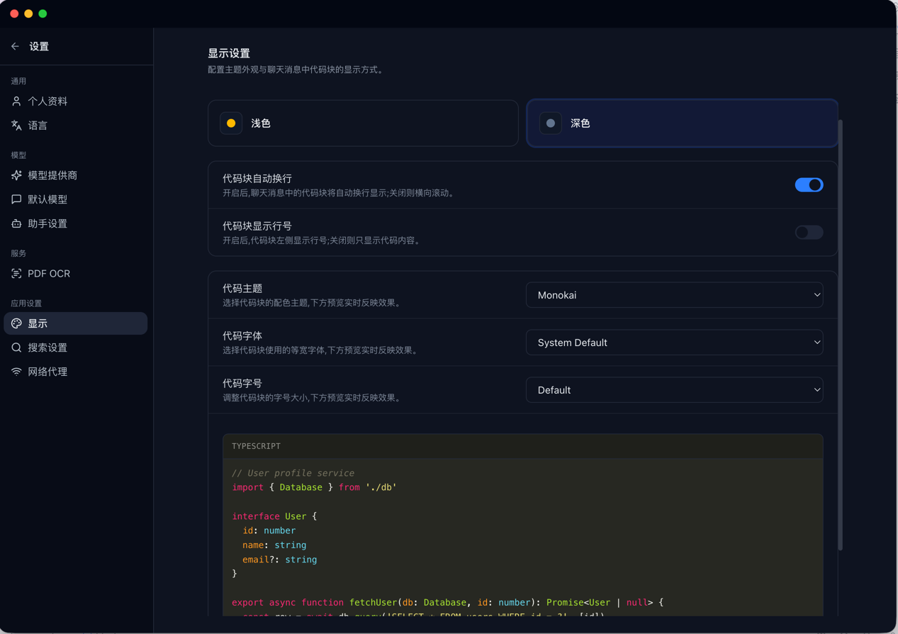

# Knowledge Studio

> 本地优先的知识库与对话应用 —— BM25 + Embedding + ReRank + GraphRAG 混合检索，多模型供应商接入，完全离线可用。

Knowledge Studio 是一个基于 Electron 的桌面端 RAG（Retrieval-Augmented Generation）应用。所有数据（对话、文档、向量、知识图谱）都保存在本地，无需服务端，无需账号，开箱即用。你只需接入自己的 LLM Provider（OpenAI / Anthropic / Gemini / Ollama / 任意 OpenAI 兼容接口），即可获得一个真正属于自己的知识助手。

---

## 截图预览

| 浅色主题整体效果 | 深色主题整体效果 |
| --- | --- |
|  |  |

| 知识库管理 | 单个知识库详情 | 设置 |
| --- | --- | --- |
|  |  |  |

---

## 核心特性

### 🔍 混合检索（Hybrid Retrieval）
- **BM25**（关键词检索，基于 `@node-rs/jieba` 中文分词）+ **Embedding**（向量语义检索，LanceDB）+ **ReRank**（重排序）三路融合
- **GraphRAG**：基于 `leiden-ts` 社区发现算法构建知识图谱，支持图谱增强检索
- **多知识库联合检索**：一次对话可挂载多个知识库，按库分配配额并融合排序

### 🤖 多模型供应商
- 支持任意 OpenAI 兼容接口（OpenAI / DeepSeek / Moonshot / 智谱 / Ollama / vLLM / LM Studio 等）
- 同时管理三类模型：**对话模型（Chat）**、**嵌入模型（Embedding）**、**重排序模型（ReRank）**
- 视觉模型支持图片输入（粘贴 / 上传），自动识别 `vision` / `vl` / `gpt-4o` / `claude-3` / `gemini` 等模型
- 模型能力按需开启，未启用的能力不会出现在 API 调用中

### 📚 文档管理
- **本地文件导入**：PDF、Word（`.docx`）、Markdown、纯文本
- **网页 URL 导入**：自动抓取并转换为 Markdown（Jina Reader 主路径 + 直接 HTTP 兜底）
- **PDF OCR**：扫描版 PDF 自动识别（基于 `pdf-ocr-service`）
- **文档重命名**：列表内联编辑标题
- **分片配置**：每个知识库可独立配置 `chunkSize` / `chunkOverlap`

### 🛠️ 工具调用（Tool Calling）
- **`knowledge_search`**：模型自主决定何时检索知识库
- **`web_search`**：内置无 Key 网络搜索（DuckDuckGo HTML 接口），开箱即用
- 多轮工具调用（最多 3 轮），最后一轮强制收敛到最终回答
- 引用支持 **知识库引用**（蓝色徽章 + 相关度评分）与 **网络引用**（绿色徽章 + 可点击 URL）两种类型

### 💬 对话体验
- **流式输出**：实时显示模型生成内容与推理过程（reasoning）
- **流式中断**：发送中可随时 Abort，已生成内容会保留
- **错误重试**：发送失败时保留上下文，一键重试
- **消息操作**：重新生成、编辑、复制、删除（hover 显示）
- **引用展示**：流式过程中即显示引用气泡（无需等待完整结束），点击查看完整来源
- **Markdown 渲染**：代码高亮、Mermaid 图表、LaTeX 公式、表格、SVG 内联渲染
- **代码块**：8 种高亮主题、8 种等宽字体、5 档字号、可选行号

### 🎨 界面与本地化
- **主题**：浅色 / 深色一键切换（侧栏底部太阳/月亮按钮）
- **代码主题**：monokai / github / github-dark / dracula / atom-one-dark / atom-one-light / vs / vs2015
- **代码字体**：system / menlo / consolas / monaco / courier / jetbrains / firacode / sfmono
- **国际化**：中文 / English / 日本語 / 한국어 / Français / Deutsch / Русский（7 种语言）

### 🔒 本地优先
- 所有数据存储在本地：`better-sqlite3`（结构化数据）+ LanceDB（向量）+ 文件系统（原始文档）
- 无遥测、无上报、无账号
- 支持配置 HTTP / SOCKS 代理

---

## 技术栈

| 层 | 技术 |
| --- | --- |
| 桌面框架 | Electron 35 + electron-vite + electron-builder |
| 主进程 | Node.js + TypeScript + better-sqlite3 + LanceDB + @node-rs/jieba |
| 渲染进程 | React 19 + TypeScript 5.7 + Tailwind CSS v4 + Zustand 5 + React Router 7 |
| Markdown | react-markdown + remark-gfm + rehype-highlight + Mermaid + highlight.js |
| 文档解析 | pdf-parse / mammoth / turndown |
| 图谱 | leiden-ts（Leiden 社区发现算法） |
| 校验 | Zod |
| 代码规范 | Biome |

---

## 项目结构

```
rag-knowledge-base/
├── src/
│   ├── main/                     # Electron 主进程
│   │   ├── index.ts              # 应用入口
│   │   ├── ipc-handlers.ts       # IPC 通道注册
│   │   └── services/             # 业务服务层
│   │       ├── chat-service.ts          # 对话编排（流式、工具调用、重试）
│   │       ├── chat-message-builder.ts  # 上下文构建
│   │       ├── builtin-tools.ts         # knowledge_search / web_search 工具
│   │       ├── search-service.ts        # 混合检索（BM25 + 向量 + ReRank）
│   │       ├── embedding-service.ts     # 嵌入服务
│   │       ├── vector-store.ts          # LanceDB 向量存储
│   │       ├── knowledge-base-service.ts# 知识库 CRUD
│   │       ├── document-service.ts      # 文档导入与分片
│   │       ├── pdf-ocr-service.ts       # PDF OCR
│   │       ├── graph-service.ts         # GraphRAG 图谱
│   │       ├── assistant-service.ts     # 助手管理
│   │       ├── settings-service.ts      # 全局设置
│   │       ├── proxy-service.ts         # 代理
│   │       ├── tokenizer.ts             # 分词
│   │       └── web-search-service.ts    # DuckDuckGo 网络搜索
│   ├── preload/                  # 预加载脚本（contextBridge）
│   ├── renderer/                 # React 渲染进程
│   │   └── src/
│   │       ├── pages/            # 路由页面（Chat / KnowledgeBase / Settings / Home）
│   │       ├── components/       # UI 组件（chat / layout / assistant / kb-icon 等）
│   │       ├── stores/           # Zustand 状态（chat / kb / assistant / settings / doc）
│   │       ├── i18n/             # 7 语种字典
│   │       └── assets/main.css   # 主题系统（CSS 变量驱动）
│   └── shared/                   # 主进程与渲染进程共享类型
│       ├── types.ts
│       └── ipc-types.ts
├── resources/                    # 应用图标等静态资源
├── scripts/                      # 构建/打包辅助脚本
├── doc/                          # 软件截图
├── DESIGN.md                     # 设计系统规范
└── package.json
```

---

## 快速开始

### 环境要求

- Node.js ≥ 20
- npm ≥ 10（或 pnpm / yarn，下文以 npm 为例）
- macOS / Windows / Linux

### 安装依赖

```bash
npm install
```

> 安装时会自动执行 `electron-builder install-app-deps`，重新编译原生模块（`better-sqlite3`、`@lancedb/lancedb`、`@node-rs/jieba`）以匹配当前 Electron 版本。

### 开发模式

```bash
npm run dev
```

启动 electron-vite 开发服务器，热重载渲染进程，主进程修改会自动重启。

### 类型检查 / Lint

```bash
npm run typecheck   # tsc --noEmit
npm run lint        # biome check src/
npm run lint:fix    # biome check --write src/
```

### 运行测试

```bash
npm test
```

使用 Node.js 内置 `node:test` 运行 `test/*.test.ts`。

---

## 打包发布

```bash
# 当前平台
npm run dist

# 指定平台
npm run dist:mac     # macOS（dmg + zip）
npm run dist:win     # Windows（nsis 安装包）
npm run dist:linux   # Linux（AppImage + deb）
```

产物输出到 `dist/` 目录。

---

## 首次使用指南

### 1. 配置模型供应商

打开应用 → 左下角 **设置** → **供应商（Providers）**：

1. 添加一个供应商（如 OpenAI、DeepSeek、本地 Ollama 等），填入 `Base URL` 与 `API Key`
2. 在 **模型（Models）** 中添加模型，开启对应能力：
   - **Chat**：对话模型（可勾选 `Text` / `Image` 输入）
   - **Embedding**：嵌入模型（用于向量检索）
   - **ReRank**：重排序模型（可选，显著提升检索质量）
3. 建议在 **默认模型（Default Models）** 中设好全局默认，避免每个助手重复配置

### 2. 创建知识库

回到首页 → **新建知识库**：

- 选择分类（通用 / 技术 / 研究 / 法律 / 医疗 / 自定义）
- 可选自定义图标（20 个 Lucide 图标任选）
- 设置分片大小与重叠（默认值适用于大多数场景）
- 选择该知识库使用的嵌入模型与 ReRank 模型

### 3. 导入文档

进入知识库详情页 → 上传区域：

- **拖拽 / 点击上传** 本地文件（PDF / Word / Markdown / TXT）
- **粘贴网页 URL**，自动抓取正文并转为 Markdown

导入后文档会自动分片、生成向量，进度条实时显示。

### 4. 开始对话

回到聊天页：

- 顶部选择助手与对话模型
- 输入框 `@` 选择一个或多个知识库（手动覆盖助手默认配置）
- 点击 🌐 开启网络搜索（无 Key，开箱即用）
- 📎 上传图片（仅视觉模型可用）
- 发送，模型会自主决定是否调用 `knowledge_search` / `web_search`

---

## 检索原理

Knowledge Studio 采用 **三路混合检索 + 工具调用** 架构：

```
用户提问
   │
   ├─ 模型自主决策 ──► knowledge_search 工具调用
   │                       │
   │                       ├─ BM25 关键词检索（jieba 分词）
   │                       ├─ Embedding 向量检索（LanceDB）
   │                       └─ ReRank 重排序（可选）
   │                       │
   │                       └─ 多知识库配额分配 → 合并 → 截断 TopK → 注入上下文
   │
   ├─ 模型自主决策 ──► web_search 工具调用（DuckDuckGo）
   │
   └─ 基于上下文生成回答，标注引用 [n]
```

- **多知识库配额**：`perKb = max(2, ⌈topK / 知识库数⌉)`，保证每个库都有机会贡献结果
- **引用编号**：跨工具轮次单调递增，避免编号冲突
- **流式引用**：每轮工具调用结束即推送 `chat:stream-citations` 事件，引用气泡在流式过程中实时出现

---

## 助手（Assistant）系统

每个助手可独立配置：

- **系统提示词（System Prompt）**
- **对话模型** 与 **ReRank 模型**（覆盖知识库级别配置）
- **上下文条数（Context Count）**：发送给 LLM 的历史消息数，默认 12
- **关联知识库**：助手默认挂载的知识库，对话时自动生效（仍可 `@` 手动覆盖）

---

## 主题与个性化

| 选项 | 取值 |
| --- | --- |
| 应用主题 | 浅色 / 深色 |
| 代码高亮主题 | monokai / github / github-dark / dracula / atom-one-dark / atom-one-light / vs / vs2015 |
| 代码字体 | system / menlo / consolas / monaco / courier / jetbrains / firacode / sfmono |
| 代码字号 | xs (11px) / sm (12px) / md (12.5px) / lg (14px) / xl (16px) |
| 显示行号 | 开 / 关 |
| 界面语言 | 中文 / English / 日本語 / 한국어 / Français / Deutsch / Русский |

所有偏好持久化到本地 SQLite，跨会话保留。

---

## 数据存储位置

| 平台 | 路径 |
| --- | --- |
| macOS | `~/Library/Application Support/Knowledge Studio/` |
| Windows | `%APPDATA%\Knowledge Studio\` |
| Linux | `~/.config/Knowledge Studio/` |

包含 `app.db`（SQLite，存储对话 / 文档元数据 / 设置）、LanceDB 向量目录、原始文档缓存。卸载应用时这些数据不会自动删除，需手动清理。
